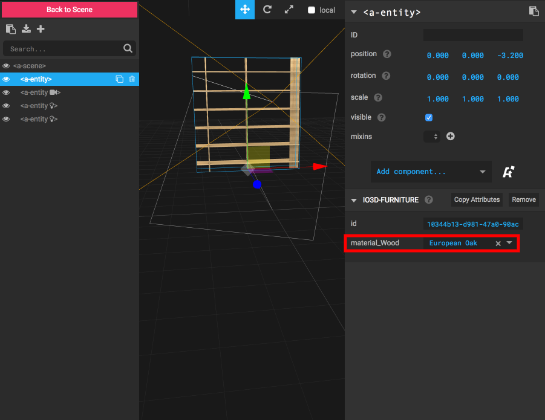

# A-Frame Components

## What can be done with the components

If you are building a 3D web application with the [A-Frame](https://aframe.io) library
you may find it convenient to **display 3D scenes** from your own or our public [Scene library](/docs/api/1/scene-library.html)
or **display furniture** from our [Furniture library](/docs/api/1/furniture-library.html).

This can be done with these components:

```html
<a-scene>
  <!-- furniture specified by id (= productResourceId) -->
  <!-- get more: https://furniture.3d.io -->
  <a-entity io3d-furniture="id:10344b13-d981-47a0-90ac-f048ee2780a6" position="-2 0 -3.2" rotation="0 180 0"></a-entity>

  <!-- data3d files specified by 3d.io store key or URL -->
  <a-entity io3d-data3d="key:/3f995099-d624-4c8e-ab6b-1fd5e3799173/170515-0913-4p3ktf/1e588a3b-90ac-4a32-b5b8-ff2fda7f87c4.gz.data3d.buffer" position="0 0 0"></a-entity>
</a-scene>
```
[Interactive demo](https://3dio-aframe.glitch.me/)

## Displaying 3d data with `io3d-data3d`

| Parameter | Description |
| --- | --- |
| `key` | Specifies a 3d.io [storage key](storage.md) to identify 3d data to display, e.g. `/3f995099-d624-4c8e-ab6b-1fd5e3799173/170515-0913-4p3ktf/1e588a3b-90ac-4a32-b5b8-ff2fda7f87c4.gz.data3d.buffer` |
| `url` | Specifies a URL of a `.data3d.json` or `.data3d.buffer` file, e.g. `https://storage.3d.io/3f995099-d624-4c8e-ab6b-1fd5e3799173/170515-0913-4p3ktf/1e588a3b-90ac-4a32-b5b8-ff2fda7f87c4.gz.data3d.buffer` |
| `lightMapIntensity` | Intensity (default 1.2) of the lightmap being applied |
| `lightMapExposure` | Exposure (default 0.6) of the lightmap being applied |

### Changing the lighting

Lighting can be configured using two properties: `lightMapIntensity` and `lightMapExposure`.

Both influence how the [precalculated lights](https://spaces.archilogic.com/blog/3d-models-light-baking) are affecting the loaded scene.
The exposure can be used to over- or underexpose the scene while the intensity allows to adjust how much the light blends with the materials.

The relation of the two settings is visualised below:


## Displaying furniture with `io3d-furniture`

The `io3d-furniture` component allows to display a piece of furniture in A-Frame.
You specify the desired piece of furniture by its `id` (e.g. )

```html
  <a-scene>
    <a-entity io3d-furniture="id:10344b13-d981-47a0-90ac-f048ee2780a6" position="0 0 -3.2"></a-entity>
  </a-scene>
```

| Parameter | Description |
| --- | --- |
| `id` | The `productResourceId` of the desired furniture piece from the [furniture library](furniture-library.md) |

### Selecting the furniture material

Furniture may have more than one material available. In this case you may select the desired material.

**Note**: Materials are associated with parts of the (or the whole) furniture.

There are three ways of changing and accessing materials:

* Using the inspector
* Using attributes in the HTML tag
* Using JavaScript

#### Using the inspector

1. Select the furniture entity in the tree on the left
2. Find the `io3d-furniture` component in the properties panel on the right
3. If more than one material is available, the available material options will appear in the panel



#### Using HTML

You can specify the material for each furniture part in the HTML attributes.

For example, the shelf below has one furniture part called `Wood`, so we use the `material_Wood` property to select the `Black Walnut Tree` material:

```html
  <a-entity io3d-furniture="id:10344b13-d981-47a0-90ac-f048ee2780a6; material_Wood:Black Walnut Tree" position="0 0 -3.2"></a-entity>
```

**Note**: Both the property names (e.g. `material_Wood`) _and_ the values (e.g. `Black Walnut Tree`) are case-sensitive.

#### Using JavaScript

You can specify and change the material using JavaScript:

```javascript
var shelf = document.querySelector('a-entity[io3d-furniture]')
var component = shelf.components['io3d-furniture']
component.data.material_Wood = 'Black Walnut Tree'
component.update()
```

### Listing available & currently selected materials

You can list all available materials by using the JavaScript API:

```javascript
var shelf = document.querySelector('a-entity[io3d-furniture]')
var component = shelf.components['io3d-furniture']
console.log(component.data.availableMaterials)
```

If the furniture has multiple materials available, this will log an object with the different parts of the furniture as properties. Each property contains an array of names for the different materials.

For example, the shelf may have a single piece (`Wood`) with a set of available materials:

```javascript
// console.log(component.data.availableMaterials)
{
  Wood: [
    Oak stained aqua blue,
    Oak stained pink pastell,
    Black Walnut Tree,
    Oak stained chalk,
    Oak stained dark warmgrey,
    Oak stained mint blue,
    Oak stained graphite grey,
    Oak stained salmon pink,
    Oak stained graphite black,
    Oak stained light warmgrey,
    Oak stained cold grey,
    European Oak
  ]
}
```

The currently selected material is available via the material properties:

```javascript
var shelf = document.querySelector('a-entity["io3d-furniture"]').components['io3d-furniture']
console.log(shelf.data.material_Wood) // "European Oak"
```

The material properties follow the naming scheme "material_" followed by the furniture part they are associated with.
